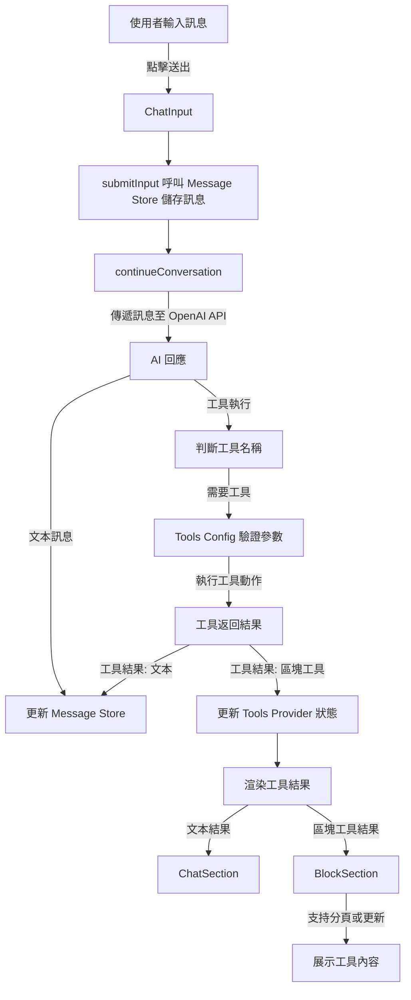

# README.md

## File Overview

本專案為 **Q&A inline tool + block tool** 的專題討論區開發，目標是提供使用者直觀的工具互動介面與詳細的步驟展示功能。主要功能包括：
- 問答模式下的訊息處理與工具執行。
- 區塊工具（Block Tool）的開啟、更新與互動操作。
- 結合即時聊天與工具結果展示的整合平台。

## TODO
### 功能開發
1. **聊天機器人功能增強**：
   - [ ] 將工具結果變成分頁顯示，增加創建與更新分頁的方法。（`sections.tsx`）
   - [ ] 支援用戶點選特定訊息或物件後進行回覆。（`sections.tsx`）
   - [ ] 實現更多樣的工具操作類型，例如新增標籤或修改現有標籤。（`tools-provider.js`）

2. **區塊工具優化**：
   - [ ] 在區塊工具中新增分頁功能，方便展示多個工具結果。（`block-section.js`）
   - [ ] 將工具結果頁優化為標籤式（tabs）界面，便於切換多個結果。（`block-section.js`）

3. **訊息管理改進**：
   - [ ] 加入 parent message 支援，用以管理訊息版本分支。（`message-store.ts`）

### 使用者體驗改進
4. **工具互動增強**：
   - [ ] 在工具執行結果中，讓用戶更直觀地選擇特定的工具結果進行深度操作或檢視。（`chat-tool.jsx`）
   - [ ] 增加交互按鈕，例如 "這一步怪怪的?" 或 "我需要詳細解釋"，讓用戶能快速反饋和學習。（`step-answer.jsx`）

5. **視覺效果改進**：
   - [ ] 實現滾動區域的自動定位到最新內容，改善用戶檢視體驗。（`chat-section.jsx`，`block-section.js`）

### 代碼重構
6. **重構與抽象**：
   - [ ] 將 `executeConversation` 等重複邏輯抽象為通用 Hook，增強代碼可讀性和復用性。（`sections.tsx`）
   - [ ] 優化工具執行邏輯，統一處理工具的增刪改操作。（`tools-provider.js`）

### 性能優化
7. **減少不必要的渲染**：
   - [ ] 優化聊天訊息渲染邏輯，僅在需要更新時觸發重新渲染。（`chat-message.jsx`）
   - [ ] 減少工具結果的渲染過程中無效的 DOM 操作。（`tools-provider.js`）

### 其他改進
8. **錯誤處理**：
   - [ ] 增強錯誤處理邏輯，確保在工具執行失敗時有用戶友好的反饋。（`actions.ts`）

## 使用到的 Library 與框架

### 前端框架
- **[Next.js 15](https://nextjs.org/)**：用於構建 React 應用的全棧框架，支援伺服器端渲染 (SSR) 和靜態生成 (SSG)。
- **[React](https://reactjs.org/)**：基於組件的用戶界面構建庫。
- **[React-DOM](https://reactjs.org/docs/react-dom.html)**：React 的 DOM 操作接口。

### 狀態管理
- **[Zustand](https://github.com/pmndrs/zustand)**：輕量化的 React 狀態管理工具，用於管理聊天訊息與工具狀態。

### 樣式與 UI 組件
- **[shadcn/ui](https://shadcn.dev/)**：使用 Tailwind CSS 打造的可復用 UI 組件庫。
- **[Tailwind CSS](https://tailwindcss.com/)**：實用性優先的 CSS 框架，用於快速設計。
- **[Tailwind Merge](https://github.com/dcastil/tailwind-merge)**：合併 Tailwind 類別的工具。
- **[TailwindCSS Animate](https://tailwindcss-animate.dev/)**：簡化動畫設計的 Tailwind 插件。
- **[Radix UI](https://www.radix-ui.com/)**：
  - `@radix-ui/react-accordion`：手風琴組件。
  - `@radix-ui/react-avatar`：頭像組件。
  - `@radix-ui/react-checkbox`：複選框組件。
  - `@radix-ui/react-progress`：進度條組件。
  - `@radix-ui/react-scroll-area`：滾動區域組件。
  - `@radix-ui/react-separator`：分隔線組件。
  - `@radix-ui/react-slot`：插槽組件。

### 工具執行與 API
- **[@ai-sdk/openai](https://github.com/vercel-labs/ai)**：整合 OpenAI 模型進行聊天與工具執行。
- **[Math.js](https://mathjs.org/)**：強大的數學運算工具，支持符號計算與數值計算。
- **[Zod](https://github.com/colinhacks/zod)**：用於工具參數驗證的結構化方案。
- **[NanoID](https://github.com/ai/nanoid)**：生成唯一識別碼的輕量工具。

### 圖示與用戶體驗
- **[Lucide-React](https://lucide.dev/docs/react)**：提供豐富且可自定義的 UI 圖示。
- **[Framer Motion](https://www.framer.com/motion/)**：用於動畫設計的工具。

### 資料可視化與數據處理
- **[Plotly.js](https://plotly.com/javascript/)**：高級數據可視化工具。
- **[React-Plotly.js](https://github.com/plotly/react-plotly.js)**：Plotly 的 React 封裝。
- **[React-Resizable-Panels](https://github.com/bvaughn/react-resizable-panels)**：可調整大小的面板。

### Markdown 與數學公式渲染
- **[React-Markdown](https://github.com/remarkjs/react-markdown)**：解析和渲染 Markdown 格式內容。
- **[Remark-GFM](https://github.com/remarkjs/remark-gfm)**：支援 GitHub Flavored Markdown。
- **[Remark-Math](https://github.com/remarkjs/remark-math)**：處理數學公式的插件。
- **[Rehype-KaTeX](https://github.com/remarkjs/rehype-katex)**：將數學公式轉為 KaTeX 格式渲染。
- **[Rehype-Raw](https://github.com/rehypejs/rehype-raw)**：支持 HTML 標籤的解析。

### 代碼高亮
- **[React-Syntax-Highlighter](https://github.com/react-syntax-highlighter/react-syntax-highlighter)**：用於代碼高亮的工具。

### 化學結構渲染
- **[React-Chemdoodle](https://github.com/malgosh/chemdoodle-react)**：用於顯示化學結構圖的 React 工具。

### 其他工具與輔助
- **[Class-Variance-Authority](https://github.com/joe-bell/cva)**：簡化條件樣式組合的工具。
- **[Clsx](https://github.com/lukeed/clsx)**：條件性合併類別的輔助工具。
- **[FS](https://nodejs.org/api/fs.html)**：Node.js 的文件系統 API。
- **[Path](https://nodejs.org/api/path.html)**：Node.js 的路徑處理模組。

### 開發與測試工具
- **TypeScript**：強類型的 JavaScript 超集，用於提高代碼質量。
- **ESLint**：用於代碼風格檢查。
- **Prettier**：用於代碼格式化。